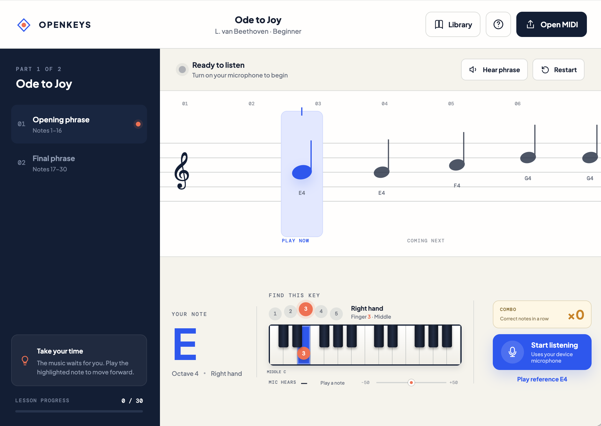

# OpenKeys

OpenKeys is a free, tablet-first instrument coach that turns standard MIDI files into interactive lessons. It listens to a real piano or guitar through the device microphone and advances at the player’s pace. It is dependency-free, privacy-friendly, and deployable to any static host.

[**Try OpenKeys in your browser →**](https://dmikey.github.io/openkeys/)



Choose a Piano or Guitar journey, select a play-along, and let OpenKeys wait for each real note. Journey progress, mastered songs, stars, milestones, and achievements stay on the device and are tracked separately for each instrument.

## Features

- Import `.mid` and `.midi` files directly in the browser
- Switch between piano and standard-tuned guitar inside the same installed app
- Separate instrument journeys with milestone progress and unlockable achievements
- Browse included lessons based on public-domain compositions
- Original code-generated cover art, difficulty filters, XP, stars, and saved progress
- Instrument-specific play-along mastery so each completed song advances the chosen path
- Correct-note combos that reward consistent playing
- Follow mode that waits until the player performs the correct note
- Focused staff view with the current note and upcoming phrase
- Physical piano map showing the target relative to Middle C and black-key groups
- Six-string guitar fretboard showing a playable string and fret for each target note
- Curated piano fingering and contextual guitar-position guidance for imported MIDI
- Live note-name, octave, and pitch-accuracy feedback
- Reference-note and phrase playback using Web Audio
- Instrument-aware playback with layered grand-piano and plucked-string guitar voices
- Shared microphone pitch detection for acoustic or electric instruments
- Responsive, keyboard-accessible interface
- No account, server, tracking, or uploaded audio

## Included music

The built-in catalog includes learning arrangements of works by Beethoven, Mozart, Bach, and James Lord Pierpont, plus the traditional French melody commonly known as “Twinkle, Twinkle, Little Star.” The underlying compositions are in the public domain. The simplified note sequences and abstract cover artwork in this repository are original project assets released under the repository license.

### Game music and community MIDI

- **Aria Math — C418:** [Aria Math - C418 (Modified MIDI Import) \[4/10/2020\]](https://onlinesequencer.net/1427781) by [Mr. Magicman](https://onlinesequencer.net/members/26737). The lesson uses the melody track from the attributed MIDI import. “Aria Math” is a copyrighted C418 composition and is not part of the public-domain catalog.

## Run locally

Browsers require a secure context for microphone access. Start a local server rather than opening the HTML file directly:

```sh
python3 -m http.server 8080
```

Then open [http://localhost:8080](http://localhost:8080).

## Instrument architecture

The lesson engine is instrument-neutral: MIDI parsing, microphone recognition, progression, scoring, XP, the library, and saved state are shared. Piano and guitar are guidance and playback adapters that provide physical note placement and an appropriate synthesized voice. New instruments can be added to the same installable app by implementing that adapter contract instead of duplicating the application.

## Install on iPhone or iPad

Open the hosted app in Safari, tap **Share**, then choose **Add to Home Screen**. OpenKeys launches in standalone mode with notch-safe layouts and no separate browser bar. If the icon was installed before the standalone metadata was added, remove that Home Screen icon and add it again so iOS refreshes the saved launch settings.

## Browser support

Recent versions of Chrome, Edge, Firefox, and Safari are supported. Dedicated layouts are provided for landscape tablets and both phone orientations, including the 414 × 896 and 896 × 414 iPhone 11 viewports. Landscape phones place the score and compact fingering coach side by side. Microphone recognition works best in a quiet room with one note played at a time.

## Roadmap

- Optional Web MIDI hardware input
- Polyphonic microphone recognition
- Expanded editor-reviewed fingering for every arrangement
- Lesson bookmarks stored locally
- Community curriculum and public-domain MIDI library

## Contributing

Issues, lesson ideas, accessibility improvements, and pull requests are welcome. The goal is to make high-quality instrument learning available to anyone with a browser.

## License

MIT
